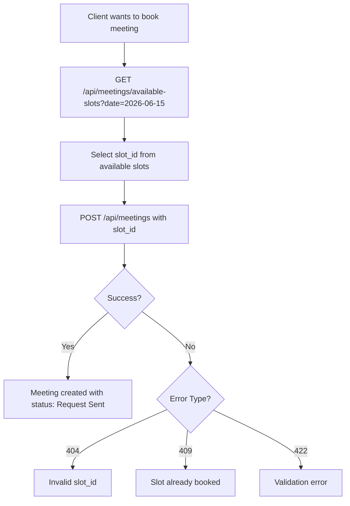

# Meetings API Endpoints Reference

## Overview
This document provides a complete reference for all meeting-related API endpoints, including role-based access control.

## Authentication
All endpoints require authentication via Bearer token:
```
Authorization: Bearer {token}
```

## Endpoints by Access Level

### 🔵 Shared Endpoints (Admin + Client)

#### Get Available Slots
**Endpoint:** `GET /api/meetings/available-slots`

**Access:** Admin, Client

**Query Parameters:**
- `date` (required) - Date in YYYY-MM-DD format

**Example Request:**
```bash
GET /api/meetings/available-slots?date=2026-06-15
Authorization: Bearer {client_token or admin_token}
```

**Success Response (200):**
```json
{
  "status": true,
  "data": [
    {
      "slot_id": 1,
      "date": "2026-06-15",
      "start_time": "10:00",
      "end_time": "11:00",
      "status": true
    }
  ]
}
```

---

#### Get Unbooked Slots
**Endpoint:** `GET /api/meetings/unbooked-slots`

**Access:** Admin, Client

**Description:** Returns all unbooked slots for the next 7 days

**Example Request:**
```bash
GET /api/meetings/unbooked-slots
Authorization: Bearer {client_token or admin_token}
```

**Success Response (200):**
```json
{
  "status": true,
  "message": "Unbooked slots retrieved",
  "data": [
    {
      "slot_id": 1,
      "date": "2026-06-15",
      "start_time": "10:00",
      "end_time": "11:00"
    }
  ]
}
```

---

#### List Meetings
**Endpoint:** `GET /api/meetings`

**Access:** Admin, Client

**Behavior:**
- Admin: Sees all meetings
- Client: Sees only their own meetings

**Example Request:**
```bash
GET /api/meetings
Authorization: Bearer {token}
```

---

#### Get Meeting Details
**Endpoint:** `GET /api/meetings/{id}`

**Access:** Admin, Client

**Example Request:**
```bash
GET /api/meetings/1
Authorization: Bearer {token}
```

---

### 🟢 Client-Only Endpoints

#### Create Meeting
**Endpoint:** `POST /api/meetings`

**Access:** Client only

**Request Body:**
```json
{
  "slot_id": 1,              // REQUIRED - from available-slots
  "meeting_name": "string",  // REQUIRED
  "description": "string",   // OPTIONAL
  "strategy_id": 12          // OPTIONAL
}
```

**Success Response (201):**
```json
{
  "status": true,
  "message": "Meeting request sent successfully",
  "data": {
    "id": 1,
    "slot_id": 1,
    "client_id": 2,
    "meeting_name": "Project Kickoff",
    "date": "2026-06-15",
    "start_time": "10:00:00",
    "end_time": "11:00:00",
    "status": "Request Sent"
  }
}
```

**Error Responses:**
- 404: Invalid slot_id
- 409: Slot already booked
- 422: Validation error

---

#### Delete Meeting
**Endpoint:** `DELETE /api/meetings/{meetingId}`

**Access:** Client only (own meetings)

**Example Request:**
```bash
DELETE /api/meetings/1
Authorization: Bearer {client_token}
```

---

#### Join Meeting
**Endpoint:** `GET /api/meetings/{meetingId}/join`

**Access:** Client only (own meetings)

**Example Request:**
```bash
GET /api/meetings/1/join
Authorization: Bearer {client_token}
```

**Success Response (200):**
```json
{
  "status": true,
  "message": "Joined successfully",
  "data": {
    "meeting_id": 1,
    "meeting_name": "Project Kickoff",
    "jitsi_url": "https://meet.jit.si/meeting-abc123",
    "start_time": "10:00",
    "end_time": "11:00"
  }
}
```

---

#### Filter Meetings
**Endpoint:** `GET /api/meetings/filter`

**Access:** Client only

**Query Parameters:**
- `status` (optional) - Filter by status

**Example Request:**
```bash
GET /api/meetings/filter?status=confirmed
Authorization: Bearer {client_token}
```

---

### 🔴 Admin-Only Endpoints

#### Update Meeting Status
**Endpoint:** `PUT /api/meetings/{id}/status`

**Access:** Admin only

**Request Body:**
```json
{
  "status": "confirmed"
}
```

**Valid Statuses:**
- `waiting`
- `request_sent`
- `confirmed`
- `completed`
- `canceled`

**Example Request:**
```bash
PUT /api/meetings/1/status
Authorization: Bearer {admin_token}
Content-Type: application/json

{
  "status": "confirmed"
}
```

---

#### Add Team Members
**Endpoint:** `POST /api/meetings/{id}/team`

**Access:** Admin only

**Request Body:**
```json
{
  "members": [
    {
      "type": "designer",
      "id": 1
    },
    {
      "type": "marketer",
      "id": 2
    }
  ]
}
```

**Example Request:**
```bash
POST /api/meetings/1/team
Authorization: Bearer {admin_token}
Content-Type: application/json
```

---

#### Remove Team Member
**Endpoint:** `DELETE /api/meetings/{id}/team/{teamMemberId}`

**Access:** Admin only

**Example Request:**
```bash
DELETE /api/meetings/1/team/5
Authorization: Bearer {admin_token}
```

---

#### Auto-Sync Team from Strategy
**Endpoint:** `POST /api/meetings/{id}/team/sync-from-strategy`

**Access:** Admin only

**Description:** Automatically adds all designers and marketers from posts linked to the meeting's strategy

**Example Request:**
```bash
POST /api/meetings/1/team/sync-from-strategy
Authorization: Bearer {admin_token}
```

**Success Response (200):**
```json
{
  "status": true,
  "message": "Team members synced successfully",
  "data": {
    "synced": [
      {
        "id": 1,
        "name": "John Designer",
        "type": "designer"
      }
    ],
    "skipped": [
      {
        "id": 2,
        "reason": "already_in_team"
      }
    ]
  }
}
```

---

## Meeting Creation Flow

### For Clients



### For Admins Managing Meetings

```
1. View all meetings: GET /api/meetings
2. View details: GET /api/meetings/{id}
3. Update status: PUT /api/meetings/{id}/status
4. Add team: POST /api/meetings/{id}/team
5. Auto-sync team: POST /api/meetings/{id}/team/sync-from-strategy
```

## Status Flow

```
Initial Creation (Client):
  ↓
Request Sent / Waiting
  ↓
Confirmed (Admin updates) → Completed (Admin updates)
  ↓
Canceled (Admin or Client)
```

## Important Notes

### Slot ID Auto-Population
When creating a meeting, you only need to provide `slot_id`. The system automatically:
1. Validates the slot exists
2. Retrieves date, start_time, end_time from the slot
3. Checks for booking conflicts
4. Creates the meeting with auto-populated values

### Access Control
- **Available Slots & Unbooked Slots**: Accessible by both admin and client
- **Create Meeting**: Client only
- **Update Status & Team Management**: Admin only
- **View Meetings**: Both can view (filtered by role)

### Notifications
The following actions trigger Firebase notifications:
- Meeting created → Admin notified
- Status updated → Client notified
- Team member added → Team member notified
- Meeting canceled → Client and team notified

## Error Codes

| Code | Meaning | Common Causes |
|------|---------|---------------|
| 200 | Success | Request completed successfully |
| 201 | Created | Meeting created successfully |
| 400 | Bad Request | Invalid request format |
| 401 | Unauthorized | Missing or invalid token |
| 403 | Forbidden | Insufficient permissions |
| 404 | Not Found | Resource doesn't exist |
| 409 | Conflict | Slot already booked |
| 422 | Validation Error | Invalid input data |
| 500 | Server Error | Internal server error |

## Postman Collection

The complete Postman collection includes all these endpoints with example requests:
- **Admin - Meetings** folder: Admin-specific operations
- **Client Meetings** folder: Client-specific operations

Import `Bareqq_Complete_API.postman_collection.json` to test all endpoints.

## Related Documentation

- `MEETING_SLOT_AUTO_POPULATE.md` - Detailed auto-population logic
- `MEETING_CREATION_UPDATE_SUMMARY.md` - Quick summary of changes
- `ADMIN_MEETINGS_COMPLETE.md` - Admin meeting management guide
- `API_MEETINGS.md` - Additional meeting API details
